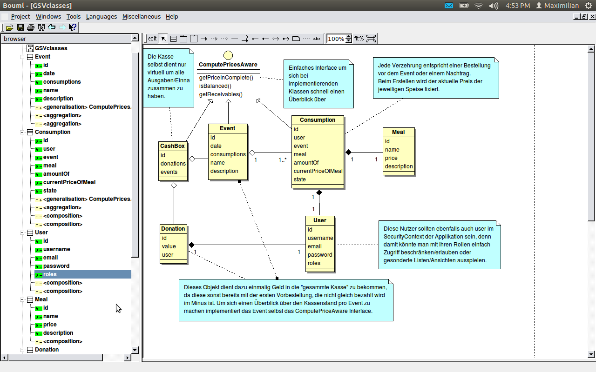

Documentation zur Umsetzung des Projektes
=========================================

Planung
-------

Da es nicht möglich ist habe ich mich entschieden die wichtigsten Schritte in einer
ToDo-Liste zu vermerken:

* [x] ZF2 SkeletonApplikation zum laufen bringen und studieren
* [x] Modelierung der Entitäten
* [x] Implementierung der Models, incl. UnitTests
* [ ] Rudimentäre Implementierung der Controller mit Templates, Forms, incl Routing und Konfiguration
* [ ] AdminBereich zusammensetzen durch Menüs
* [ ] Visueller Test (durch klicken)
* [ ] Erstellen von speziellen AusgabeListen

Jeder Punkt sollte unten in seiner Ausführung weiter durch dacht sein.

ZF2 SkeletonApplikation
~~~~~~~~~~~~~~~~~~~~~~~

Hier liegt der Schwerpunkt darin die Grundfunktionen des ZF2 schnell zu erfassen. Gewissen Parallelen
zu Symonfy2 sind zu erkennen. So kann man services ebenfalls konfigurieren und somit DependencyInjection
betreiben. Für dieses Projekt werde ich aber die Controller mit dem ZF BasisController aufbauen. Dieser
hält gleich den kompletten `ServiceLocator` bereit aus dem ich mich relativ schnell bedienen kann.
Für spätere Umsetzungen und bei Refaktorierungen sollte man hier den Controller als Service definieren,
und nur die benötigten Services "injecten". Ebenfalls werde ich die einfachen `*.phtml` Templates
übernehmen ehe ich jetzt noch eine TemplateEngine einführen müsste.

Modelierung
~~~~~~~~~~~

Hierbei habe ich begonnen einige Modele auf dem Papier zu skizieren - im Grunde nur Klassendiagramme
in UML. Hier ist die digitale Form der Diagrame:

Für die Datenbank werden alle Relationen und Felder ebenso abgebildet. Ausgenommen davon ist die Klasse
`CashBox` diese existiert im grunde nur Virtuell als Zusammenführung von Daten. Man könnte sich hier für
verschiednen Ausgaben jedoch Views vorstellen.

Implementierung der Models
~~~~~~~~~~~~~~~~~~~~~~~~~~

Hier habe ich mich aus Vertrauen und Erfahrung für die Nutzung von Doctrine2 für die Persistence-Aufgaben
entschieden. Ich bin es gewohnt die Teile der Models, die zur für die Persistierung notwendig sind,
in einem Ordner `Doctrine\Orm` abzulegen währen domain-spezifische Funktionen und Eigenschaften in den
Ordner `Models` gehören. Dies lässt sich gerade beim ORM nicht so strikt umsetzen, da die Felter meist
schwer zu trennen sind. Darum liegen die Entitäten, die für Tabellen in der Datenbank stehen komplett im
Ordner `Doctrine\Orm`, sonst könnten diese von Models aus dem Ordner `Models` erben.
Bei den Models werde ich UnitTest für die Implementierung des `ComputePricesAware` Interfaces schreiben,
denn diese Funktionen sind besonders heikel, wenn es darum geht ein zuverlässiges Ergebniss für die
verschiedenen Statistiken zu erhalten. Die meisten anderen Funktionen sind meist nur Setter/Getter.

Rudimentäre Implementierung der Controller
~~~~~~~~~~~~~~~~~~~~~~~~~~~~~~~~~~~~~~~~~~

Wie bereits oben beschrieben werde ich die Controller erst einmal so umsetzen dass Sie die sog.
CRUD Methoden abbilden. Dazu müssen die `Routen` in der Modul-Konfiguration angelegt werden,
Form-Klassen für die Entitäten implementiert werden und die HTML-Templates erstellt werden.
Für die Eigenschaften der Entitäten werden Validierungen Serverseitig durch geführt. Die Client-Seitigen
werde ich erst einmal weglasse, da sie zum einem nichts zur Sicherheit beitragen und zum anderen im Grunde
dopperten Code bedeuten. Sie sind aber eine nette Funktionalität für den Nutzer, darum werde ich
zumindest an gegebenen stelen `required` Werte für die HTML5-Validierung setzen. (Wer fortschrittliche
Formulare und Technik will, sollte auch neue Browser einsetzen)
Beim Erstellen der Formulare werde ich dann sehen, wie sich diese erstellen lassen.

AdminBereich zusammensetzen durch Menüs
~~~~~~~~~~~~~~~~~~~~~~~~~~~~~~~~~~~~~~~

Hier werde ich einen `base-view` inklusive Menü erstellen. Dazu müsste ich bei den Controller
am besten gleich einen abstrakten Controller umsetzen der mir die `partitional-views` gleich immer
in den `base-view` einsetzt. `Nested Views` sollte hier das Zauberwort in der ZF-Dokumentation sein.

Visueller Test (durch klicken)
~~~~~~~~~~~~~~~~~~~~~~~~~~~~~~

In der kürze der Zeit ist es natürlich nicht Möglich große End-To-End-Tests zu schreiben oder gar alles
einmal durchklicken zu lassen, darum werde ich diesen Punkt per Hand erledigen.
Jegliches Anlegen, Bearbeiten und Auflisten von den Kern-Entitäten (`Events` & `Consumptions`) sollte
reibungslos funktionieren. Hierbei kann man gleich gewisse Validierungen checken

Erstellen von speziellen AusgabeListen
~~~~~~~~~~~~~~~~~~~~~~~~~~~~~~~~~~~~~~

Für die speziellen Ausgaben werde ich sogenante `Blocks` auf einer Route namens `dashboard` erstellen.
Dazu erstelle ich einen Controller, der kleine Services für die Erstellung der Daten aufruft. Diese
Services, sind im Grunde genommen einfache `Repositories`, die SQL-Quries auführen.

todo: verfeinern der Abfragen überlegen der Queries, Umsetzung mit `QueryBuilder`
